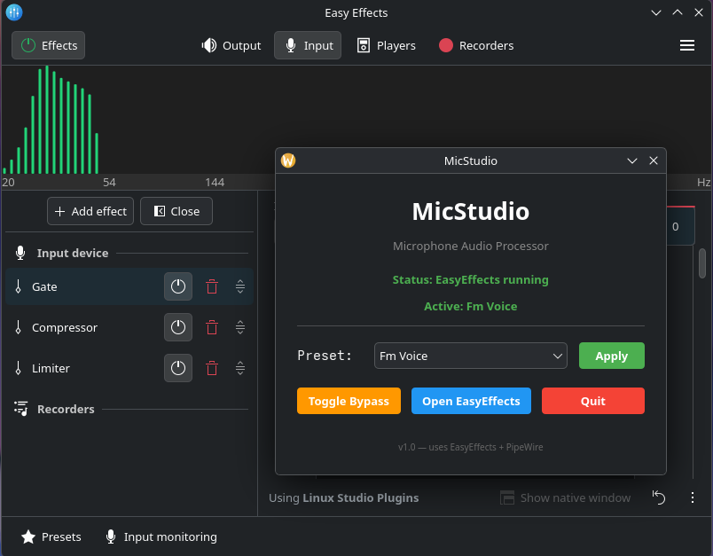

# MicStudio

Open-source microphone audio processor for Linux.
Like Logitech G HUB / Elgato Wave Link — but open source and Linux-native.



## Features

- **Noise Gate** — cuts background noise when silent
- **Compressor** — evens out volume levels
- **Limiter** — prevents clipping
- **Equalizer** — tone shaping for your voice
- **System tray** — quick preset switching from tray menu
- **One-click presets** — instantly switch between voice profiles

## Presets

| Preset | Description |
|--------|-------------|
| **Gaming** | Aggressive gate, voice presence in the mix |
| **Podcast** | Warm and full voice |
| **Streaming** | Balanced for game + voice |
| **FM Voice** | Classic radio broadcaster sound |
| **Radio** | Hard compression, tight EQ |
| **AI Voice** | Tight compressed modern podcast sound |
| **Whisper** | High gain, gentle processing for quiet voices |
| **Noise Suppression** | Aggressive background noise cutting |

## Installation

```bash
git clone https://github.com/YOUR_USER/mic-studio
cd mic-studio
chmod +x install.sh
./install.sh
```

**Supported distributions:**
- Arch / CachyOS / Manjaro / EndeavourOS (`pacman`)
- Ubuntu / Debian / Pop!_OS / Linux Mint (`apt`)
- Fedora (`dnf`)
- openSUSE (`zypper`)

The installer automatically detects your distro and installs dependencies (PipeWire, EasyEffects, PyQt6).

## Usage

```bash
mic-studio
```

Or find **MicStudio** in your application menu.

1. Select a preset from the dropdown
2. Click **Apply**
3. In Discord / games, select **"Easy Effects Source"** as input device

### System tray

MicStudio minimizes to the system tray. Right-click the tray icon to:
- Switch presets quickly
- Toggle bypass
- Show/hide window

## Requirements

- PipeWire + pipewire-pulse
- EasyEffects 8.x
- Python 3 + PyQt6

## Project structure

```
mic-studio/
├── presets/              # EasyEffects preset JSON files
│   ├── Gaming.json
│   ├── Podcast.json
│   ├── Streaming.json
│   ├── FM Voice.json
│   ├── Radio.json
│   ├── AI Voice.json
│   ├── Whisper.json
│   └── Noise Suppression.json
├── src/
│   └── main.py           # PyQt6 GUI application
├── engine.py             # EasyEffects management engine
├── install.sh            # Cross-distro installer
└── README.md
```

## How it works

MicStudio uses **EasyEffects** as the audio processing backend and **PipeWire** as the audio server. It manages EasyEffects presets and provides a simple GUI/tray interface for switching between them.

Applications like Discord, OBS, and games see the processed audio through the **"Easy Effects Source"** virtual device.

## License

MIT
